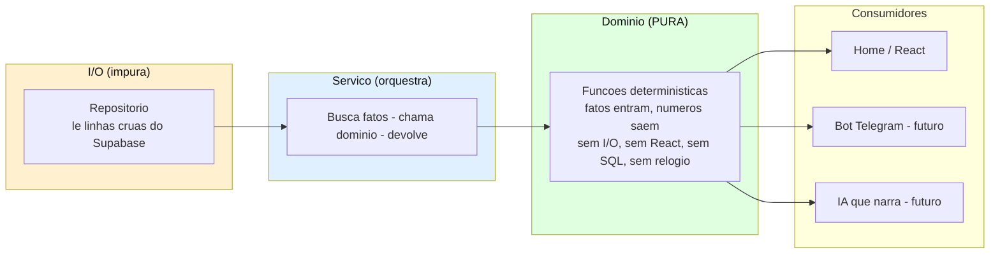

# Budgy Finance — Camada de Domínio (Spec)

| | |
|---|---|
| **Fase** | Gerenciador manual pessoal + insight enxuto (Fase 1) |
| **Base** | Product Vision r5 (Seções 10 e 14) + Modelo de Dados (ERD) |
| **Natureza** | Especificação de **assinaturas e contratos**. Não é implementação. |
| **Regra de ouro** | O código calcula os números de forma exata e determinística; a apresentação (React, bot, IA futura) apenas exibe/narra. Nunca inventa nem recalcula. |

> Este documento define a espinha de cálculo do sistema: funções **puras**, sem I/O, que recebem fatos e devolvem números. É o que garante que os mesmos cálculos sirvam à Home hoje e a um bot/IA amanhã sem reescrita ("bot-ready").

---

## 1. Arquitetura em camadas

O erro clássico é a tela buscar dados e calcular dentro do componente. Aí o número vive preso à tela e nada mais consegue reaproveitá-lo. A fronteira abaixo evita isso.



**Regras da fronteira:**
- Funções de domínio **não buscam dados** — recebem os fatos já carregados.
- Quem busca é o **repositório**; quem orquestra (busca → domínio → devolve) é uma fina camada de **serviço**.
- **Padrão de carga:** buscar os fatos do mês **uma vez** e rodar vários cálculos sobre o mesmo conjunto em memória. Nunca uma query por número.
- O bot futuro é "só uma casca": chama as mesmas funções puras, passando os mesmos fatos.

---

## 2. Tipos de domínio

```typescript
type Cents = number;          // SEMPRE inteiro. Nunca float. Nunca reais.
type Competencia = string;    // 'YYYY-MM-01' — 1o dia do mês. Chave de agregação.
type IsoDate = string;        // 'YYYY-MM-DD' — data-calendário, SEM hora (evita bug de fuso).

type ExpenseKind = 'fixa' | 'variavel';
type ExpenseStatus = 'pago' | 'pendente';
type IncomeStatus = 'previsto' | 'recebido';
type WalletType = 'conta' | 'vale_alimentacao';

interface Wallet {
  id: string; type: WalletType;
  restrictedUse: boolean; restrictionTag: string | null;
  openingBalanceCents: Cents;
}
interface Expense {
  id: string; walletId: string; categoryId: string;
  recurringExpenseId: string | null;
  kind: ExpenseKind; amountCents: Cents;
  dueDate: IsoDate; competencia: Competencia;
  status: ExpenseStatus; paidDate: IsoDate | null;
}
interface Income {
  id: string; walletId: string; categoryId: string | null;
  recurringIncomeId: string | null;
  amountCents: Cents; date: IsoDate; competencia: Competencia;
  status: IncomeStatus;
}
interface MonthlyCeiling { competencia: Competencia; amountCents: Cents; }
```

**Regra de tipo inegociável:** `Cents` é sempre inteiro. O domínio nunca recebe `12.34` reais — recebe `1234`. A conversão para `R$ 12,34` é responsabilidade **exclusiva da apresentação**.

---

## 3. Duas naturezas de número (a distinção que organiza tudo)

| Natureza | Conta o quê | Funções | Regra |
|---|---|---|---|
| **Caixa** (o que existe) | Só o efetivado | saldo, entrada do mês, saída do mês | Entradas `recebido`, despesas `pago`. Previsto/pendente **não** entram. |
| **Controle** (o comprometido) | Tudo que foi assumido | gasto variável vs teto, falta pagar | Todas as variáveis (pago+pendente); todos os pendentes. |

**Assimetria proposital:** caixa subestima (só o que entrou), controle superestima (tudo que se assumiu). Os dois puxam para a prudência — a Home **nunca** mostra situação melhor que a real. Coerente com R9 (não dar falsa sensação de controle).

**Fluxo vs estoque:**
- **Entrada / saída do mês** = *fluxo*. Zeram a cada mês; medem só o movimento daquele mês — por **competência**, não por data. ⚠ Com `competenciaOffsetMonths = 1`, o salário recebido em 25/07 **entra no saldo** naquele dia (é caixa real) mas **não** aparece na "entrada de julho" (pertence a agosto). Divergência correta e proposital; a UX precisa rotulá-la.
- **Saldo** = *estoque*. Não zera; acumula através dos meses; é a posição real de caixa **por carteira**. Pode subir ou descer. É "o que tenho", não "o que reservei" (metas/reservas estão fora desta fase).

---

## 4. Funções — assinaturas e contratos

### 4.1 Materialização das recorrências

```typescript
function computeExpectedOccurrences(
  models: RecurringExpense[],
  competencia: Competencia
): ExpectedOccurrence[]
```

Contratos (é onde mais nascem bugs):
- **Vigência:** só gera se `active = true` **e** `competencia ∈ [start_month, end_month]`. Modelo desligado ou fora da vigência não gera nada.
- **Grampeamento de dia:** se `due_day` não existe no mês (ex.: 31 em fevereiro), usa o **último dia do mês**. Previne perda de ocorrência e data inválida.
- **Idempotência é do repositório:** esta função só *calcula* o conjunto esperado. A gravação é **insert-if-missing** apoiada em `UNIQUE(recurring_expense_id, competencia)`.
- **Nunca update:** editar o modelo não altera ocorrência já materializada. A materialização preenche buracos; jamais reescreve o passado.
- **Deslocamento de competência (só entradas):** `RecurringIncome` carrega `competenciaOffsetMonths` (default `0`). A ocorrência gerada tem `date` no mês real e `competencia` deslocada em N meses. Ex.: recebimento dia 25 com offset `1` → `date = 2026-07-25`, `competencia = 2026-08-01`. ⚠ A **chave de idempotência continua sendo `(recurring_income_id, competencia)`** — ou seja, a competência já deslocada. Calcular a chave com a competência crua duplicaria ocorrências.

### 4.2 Saldos (caixa real)

```typescript
function saldoCarteira(wallet: Wallet, incomes: Income[], expenses: Expense[]): Cents
function saldoLivre(wallets: Wallet[], incomes: Income[], expenses: Expense[]): Cents  // exclui VA
function saldoVA(wallets: Wallet[], incomes: Income[], expenses: Expense[]): Cents      // só VA
```

Contrato:
```
saldo = opening_balance
      + entradas com status 'recebido'   (previsto NÃO entra)
      − despesas com status 'pago'        (pendente NÃO entra)
      considerando APENAS lançamentos com data >= wallet.openingDate
```
- ⚠ O filtro por `openingDate` é obrigatório. O saldo inicial é a foto de um instante e **já embute** tudo que veio antes; sem o filtro, um lançamento anterior seria descontado duas vezes.
- `saldoLivre` **nunca** soma o VA. `saldoLivre` e `saldoVA` são exibidos lado a lado, jamais fundidos num "disponível" único (R11).

### 4.3 Agregados do mês

```typescript
function entradaDoMes(incomes: Income[], competencia: Competencia): Cents
function saidaDoMes(expenses: Expense[], competencia: Competencia): Cents
function totalFixasDoMes(expenses: Expense[], competencia: Competencia): Cents
function gastoVariavelDoMes(expenses: Expense[], wallets: Wallet[], competencia: Competencia): Cents
```

- **`entradaDoMes`** = soma das entradas `recebido` do mês. Previsto não conta.
- **`totalFixasDoMes`** = soma das `kind='fixa'` do mês. Número **derivado** (o "espelho"); o usuário nunca digita.
- **`gastoVariavelDoMes`** = soma das `kind='variavel'` do mês, **pago + pendente**, **excluindo carteira VA**. É este número que bate contra o teto.

### 4.4 Falta pagar (com atraso)

```typescript
function faltaPagar(expenses: Expense[], hoje: IsoDate, competenciaAtual: Competencia): FaltaPagarResult
function isAtrasado(expense: Expense, hoje: IsoDate): boolean   // derivado, nunca salvo
```

- **`isAtrasado`** = despesa `pendente` cujo vencimento **virou o mês** (competência anterior à atual) **ou** **passou 5 dias do vencimento** — o que ocorrer primeiro. Derivado de `hoje`; nunca vira coluna (senão exigiria job diário).
- **`faltaPagar`** = pendentes do mês atual **+** pendentes atrasados de meses anteriores. Evita o "órfão do atraso" (conta do mês passado que sumia da tela). O resultado separa **a vencer** de **atrasado** para a Home sinalizar.

### 4.5 Teto vs variável

```typescript
function statusTeto(gastoVariavel: Cents, teto: MonthlyCeiling | null): TetoStatus
// TetoStatus = { tetoCents, gastoCents, restanteCents, percentualUsado, estourou }
```

- Sem teto definido no mês → estado **"sem teto"** (não zero — zero mentiria).
- **`percentualUsado`** = inteiro **arredondado para baixo** (79,8% → 79%). Regra fixa aqui para o app inteiro mostrar o mesmo número.
- O default de herdar o último teto é da camada de escrita/serviço, não desta função pura.

### 4.6 Insight enxuto (freio de escopo — R12)

```typescript
function gastoPorCategoria(expenses: Expense[], competencia: Competencia): CategoriaGasto[]
function comparacaoMesAMes(expenses: Expense[], meses: Competencia[]): ComparacaoMes[]
```

- **`gastoPorCategoria`** agrupa por `categoryId` (por isso categoria é obrigatória e controlada; texto livre fragmentaria o gráfico).
- **`comparacaoMesAMes`** devolve o total por mês pedido. **Só isso.** Nada de tendência, projeção ou média móvel sem evidência de que o número simples não comunica (contrato de escopo, não detalhe).

---

## 5. Contratos transversais (valem para todas)

- **Dinheiro:** tudo em `Cents` inteiro. Toda divisão (percentual, média) tem regra de arredondamento explícita na assinatura. Nunca fração de centavo solta.
- **Datas sem hora:** data-calendário `'YYYY-MM-DD'`, sem timestamp — mata o bug "dia 31 virou 30 por fuso". `hoje` **entra como parâmetro**, nunca é lido de `new Date()` dentro da função (testabilidade + determinismo).
- **Pureza:** nenhuma função de domínio faz I/O, lê relógio, ou importa React/Next/Supabase. Recebe fatos, devolve números. Garante o "bot-ready" e torna cada função testável com uma tabela entrada→saída.

---

## 6. Nota de UX herdada da assimetria

O número comparado ao **teto** inclui pendentes (comprometido), enquanto o **saldo** só reflete o pago (liquidado). São corretos, mas divergem: o variável pode "estourar" o teto enquanto ainda há dinheiro na conta. A Home deve deixar isso explícito (ex.: "você já comprometeu R$X do teto, incluindo contas não pagas") para não confundir. Decisão de UX para a fase de telas; registrada aqui para não se perder.

---

*Próximo passo sugerido: a partir deste spec, especificar os fluxos de tela (lançamento rápido, Home, config) e só então preparar a spec de implementação para o Claude Code.*
