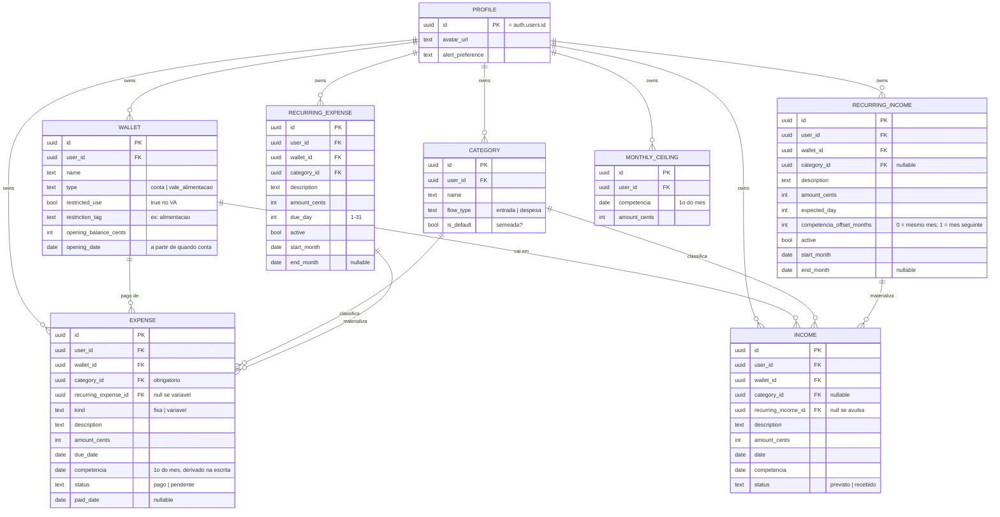

# Budgy Finance — Modelo de Dados (ERD)

| | |
|---|---|
| **Fase** | Gerenciador manual pessoal + insight enxuto (Fase 1 do roadmap) |
| **Escopo** | Entradas (com carteira VA), despesas fixas recorrentes + variáveis, Home, teto de variáveis, gráficos por categoria e mês a mês |
| **Base** | Product Vision r5 — Seção 14 |
| **Adormecido (fora deste modelo)** | Import OFX, multi-banco, cartão de crédito, bot, IA |

> Este documento define o modelo de dados da fase atual. As tabelas guardam **fatos**; todos os agregados (saldo, total de fixas, gasto variável, falta pagar, atraso, gráficos) são **derivados em código**, nunca armazenados. É a "regra de ouro" da Seção 10 virada arquitetura.

---

## 1. Decisões travadas

| Tema | Decisão |
|---|---|
| **Recorrência** | Materialização preguiçosa: o modelo recorrente é a fonte; ao abrir um mês, o sistema garante (upsert idempotente) as ocorrências daquele mês. Sem cron. |
| **Edição de modelo** | Não altera ocorrências já materializadas (preserva histórico). Vale da mudança em diante. |
| **Dinheiro** | Sempre inteiro de centavos (`_cents`). Nunca ponto flutuante. |
| **Mês (competência)** | Cada lançamento tem `competencia` = 1º dia do mês, derivada na escrita a partir da **data de referência** — que na despesa é o **vencimento** (`due_date`), nunca a data de pagamento. Pagar adiantado **não** move a despesa de mês. |
| **Competência deslocada** | A competência derivada pode ser **sobrescrita**: modelo de entrada recorrente tem `competencia_offset_months` (salário do dia 25 conta para o mês seguinte), e lançamentos avulsos aceitam ajuste manual opcional. Exceção declarada — **não** é mês fiscal customizado. |
| **Atraso** | Derivado, não salvo: uma despesa `pendente` é atraso quando *virou o mês* **ou** *passou 5 dias do vencimento* — o que ocorrer primeiro. Entra no "falta pagar" mesmo sendo de mês anterior. |
| **Categoria** | Lista controlada: tabela semeada com padrões + usuário pode adicionar. Nunca texto livre. |
| **VA (vale-alimentação)** | Carteira separada com saldo próprio, uso restrito. Gasto no VA fica **fora** do teto de variáveis (filtro por carteira, não flag na despesa). |
| **Entrada recorrente** | Materializa como `previsto`; usuário confirma para `recebido` (não infla saldo). |
| **Teto** | Por competência (não valor único global), para comparação mês a mês honesta. Default: herda o último valor. |
| **Camada de cálculo** | Funções puras em TypeScript, isoladas de React e de SQL ("bot-ready"). |

---

## 2. Diagrama entidade-relacionamento



---

## 3. Notas por entidade

**PROFILE** — 1:1 com `auth.users` do Supabase. Guarda só preferências (foto, alerta). Auth de usuário único; conta semeada, sem tela de cadastro.

**WALLET** — carteira/conta como entidade (prepara multi-banco futuro sem retrabalho). `type` distingue conta comum de VA. `restricted_use`/`restriction_tag` marcam o VA como "só alimentação". `opening_balance_cents` é o saldo inicial e `opening_date` é **a partir de quando o app conta** — sem essa data, um lançamento anterior à foto do saldo seria descontado duas vezes (o saldo informado já o embute). Saldo da carteira = `opening_balance + entradas − saídas` **com data >= `opening_date`**.

⚠ A dupla `opening_balance_cents` + `opening_date` é **imutável após a criação** (ADR-017). Uma sem a outra é ambígua: "R$ 3.000" só significa algo acompanhado de "em que dia".

**CATEGORY** — lista controlada. `is_default` marca as semeadas; usuário adiciona as próprias. `flow_type` separa categorias de entrada e de despesa. Sem isso, o gráfico por categoria fragmenta e o insight (H1) morre.

**RECURRING_EXPENSE / RECURRING_INCOME** — os **modelos** recorrentes (não as ocorrências). `due_day`/`expected_day` = dia do mês. `active` liga/desliga sem apagar histórico. `start_month`/`end_month` limitam a vigência. São duas tabelas de dados, mas o algoritmo de materialização é **um só**, parametrizado na camada de domínio — sem duplicar a lógica que mais dá bug.

`competencia_offset_months` (só em RECURRING_INCOME) resolve o caso do **salário recebido antes da virada do mês**: recebimento em 25/07 com offset `1` gera ocorrência com `date = 2026-07-25` e `competencia = 2026-08-01`. O dinheiro entra no saldo na data real; a competência o atribui ao mês que ele de fato banca. Default `0`.

**EXPENSE** — fixa e variável na mesma tabela, separadas por `kind`. Ocorrência de fixa tem `recurring_expense_id` preenchido; variável tem `null`. `competencia` armazenada (derivada de `due_date` na escrita) é a chave da materialização e acelera consultas por mês.

⚠ **Competência vem do vencimento, não do pagamento.** `paid_date` registra quando saiu o dinheiro e afeta apenas o saldo; não altera `competencia`. Consequência útil: pagar em 27/07 uma conta que vence em 05/08 mantém a despesa em agosto, marcada como paga — cenário comum para quem recebe antes da virada do mês.

**INCOME** — espelha EXPENSE para entradas. `status` = `previsto | recebido`: recorrente nasce previsto, vira recebido na confirmação (não infla saldo).

**MONTHLY_CEILING** — teto de variáveis por competência (não global), para comparação mês a mês honesta. Único valor definido pelo usuário; tudo mais é derivado.

---

## 4. Restrições críticas

| Constraint | Por quê |
|---|---|
| `UNIQUE(recurring_expense_id, competencia)` em EXPENSE | Torna a materialização preguiçosa idempotente. Abrir o mês duas vezes não duplica. É a linha mais importante do schema. |
| `UNIQUE(recurring_income_id, competencia)` em INCOME | Idem, para entradas. |
| `UNIQUE(user_id, competencia)` em MONTHLY_CEILING | Um teto por mês por usuário. |
| `category_id NOT NULL` em EXPENSE | Categoria obrigatória (o gráfico depende disso). |
| `wallet_id NOT NULL` em EXPENSE e INCOME | É o que separa dinheiro livre do VA restrito no cálculo do teto. |
| RLS por `user_id` em **todas** as tabelas | Isolamento de dados; toda tabela carrega `user_id` e tem policy própria. |

---

## 5. Derivado vs armazenado

**Armazenado (fatos):** carteiras, categorias, modelos recorrentes, ocorrências de despesa/entrada, teto por mês, saldo inicial de carteira.

**Derivado (nunca vira coluna):** saldo, entrada do mês, saída do mês, total de fixas do mês, gasto variável do mês, falta pagar (pendentes + atrasados), status de atraso, gasto por categoria, comparação mês a mês, variável vs teto.

**Única denormalização deliberada:** `competencia` — porque é chave de idempotência da materialização e estabiliza as consultas por mês.

---

## 6. Regra do teto (VA fora)

```
gasto_variavel_do_mes =
  soma(amount_cents) de EXPENSE
  where kind = 'variavel'
    and competencia = mês
    and wallet.type != 'vale_alimentacao'

alerta_teto = gasto_variavel_do_mes > MONTHLY_CEILING.amount_cents (do mês)
```

Fixas ficam fora do teto por definição (`kind = 'fixa'`), apenas somadas à parte. VA fica fora por carteira.

---

*Próximo passo sugerido: especificar a camada de domínio — as funções determinísticas "bot-ready" (entrada do mês, saldo, falta pagar, gasto por categoria, comparação mês a mês), com assinaturas e contratos, isoladas de React e de SQL.*
