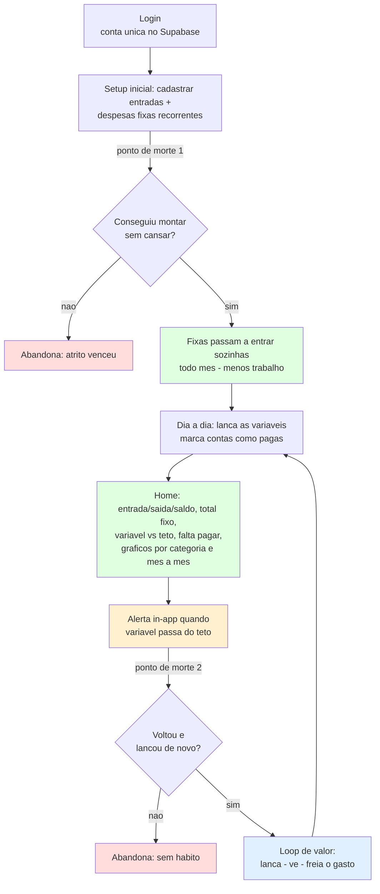

# Product Vision Document — Budgy Finance

| | |
|---|---|
| **Produto** | Budgy Finance — gestão financeira pessoal (visão de longo prazo: consolidação multi-banco + insight) |
| **Status** | Escopo simplificado para uso próprio · pré-implementação |
| **Fase atual** | Gerenciador financeiro pessoal **manual** (n=1: apenas o fundador) · uso próprio |
| **Data** | 15/07/2026 |
| **Repositório** | github.com/Freitas024/budgy-finance (stack aproveitável; produto a reconstruir) |
| **Revisão** | r5 — **insight enxuto entra nesta fase**: gráfico de gasto por categoria + comparação mês a mês (categoria vira campo obrigatório) e card "falta pagar este mês" na Home. **Bot** (Telegram) fica como *canal* preparado-mas-adiado: as consultas que ele responderia ("quanto gastei de variável", "o que falta pagar") já são respondidas dentro do app. **Adormecidos:** import OFX, multi-banco, conexão automática. **r4:** escopo reduzido a gerenciador manual (entradas com carteira VA separada; despesas fixas recorrentes + variáveis com data e status pago/pendente; teto mensal só de variáveis com alerta in-app; total de fixas calculado). |

> **Como ler este documento.** Ele não é uma peça de marketing. Os blocos com ⚠ são apostas não validadas ou riscos ativos — mantidos de propósito. A seção 13 consolida hipóteses e riscos. O documento distingue **dois horizontes**: a *visão de longo prazo* (seções 1-2, ainda válida como norte) e o *produto desta fase* (seções 6-8, um gerenciador manual enxuto). Onde algo da visão está fora desta fase, está marcado como **adormecido** — não cancelado.

---

## Resumo executivo

**Visão de longo prazo (o norte):** a maioria das pessoas não sabe para onde vai o próprio dinheiro — não por falta de dado, mas por falta de entendimento e de visão unificada, agravada por o dinheiro viver espalhado por vários bancos. O Budgy busca ser o lugar onde a pessoa vê tudo junto e **entende**, transformando dados crus em clareza que muda decisões. Consolidação multi-banco é o gancho; o insight é o moat.

**Produto desta fase (o que se constrói agora):** um **gerenciador financeiro pessoal manual**, para o fundador ter controle do próprio dinheiro. Registrar entradas e despesas, separar despesas fixas (recorrentes) de variáveis, ver entradas/saídas/saldo do mês, acompanhar contas pagas e pendentes, e definir um **teto de gasto variável** com alerta. Import automático (OFX) e a camada de insight rica ficam **adormecidos** junto com o multi-banco — reativáveis quando o objetivo passar de "uso próprio" para "viabilidade para outros". Nesta fase valida-se a coisa mais básica e mais decisiva: **o fundador sustenta o hábito de manter isso atualizado, e ver os números o ajuda a controlar o gasto?**

---

## 1. Problema (visão de longo prazo)

As pessoas não sabem para onde vai o próprio dinheiro. O extrato existe, mas falta **entendimento** e **visão do todo**. No Brasil isso se agrava porque o dinheiro vive fragmentado: conta salário em um banco, carteira digital para o dia a dia, outra instituição para outra coisa, PIX, múltiplos cartões. Nenhum app de banco mostra o conjunto — cada um enxerga só a própria fatia.

Os bancos até categorizam gastos, mas resolvem o problema errado: exibem o passado de forma crua ("R$ 47 no débito"), sem contexto, sem sinal que ajude a mudar de comportamento. O resultado — mesmo para quem ganha razoavelmente — é a sensação de que "o dinheiro some".

Quatro dores distintas:

- **Fragmentação** — não há lugar com a visão do todo. *(Dor de aquisição — gancho multi-banco. Adormecida nesta fase.)*
- **Falta de contexto** — dado bruto não é entendimento. *(Dor central — o moat. Nesta fase atacada de forma enxuta: gráfico por categoria + comparação mês a mês, além da Home e do teto. O insight rico/proativo ainda é próximo degrau.)*
- **Atrito de lançamento** — registrar tudo à mão cansa, e é por isso que apps financeiros são abandonados em semanas. *(Nesta fase, com tudo manual, este é o risco número 1 — ver R3 e R9.)*
- **Ausência de sinal** — relatório do mês passado não muda nada; o que muda comportamento é o alerta a tempo. *(Nesta fase, o único sinal é o alerta de teto de variáveis.)*

---

## 2. Visão do produto (longo prazo)

**Ser o lugar onde a pessoa enxerga, de forma unificada, para onde vai o seu dinheiro — transformando dados espalhados por vários bancos em clareza que muda decisões.**

O norte não é "gráficos bonitos" nem "conectar em muitos bancos" — isso é meio. O norte é gerar **entendimento acionável**. Consolidação multi-banco é a porta de entrada; o entendimento é o motivo de ficar.

> ⚠ **Nota de coerência:** o produto desta fase (gerenciador manual) é um subconjunto operacional dessa visão, não a visão inteira. Ele serve para o fundador controlar o próprio dinheiro e provar que mantém o hábito. As partes que constroem o *diferencial* (insight rico, multi-banco, import) estão adormecidas e retornam quando o objetivo virar "outros".

---

## 3. Objetivos

**Objetivo primário desta fase (n=1):** entregar um gerenciador manual que o **fundador realmente use e mantenha atualizado**, e verificar se enxergar os próprios números (entradas, saídas, fixas, variável vs teto) o ajuda a controlar o gasto. Crescimento **não é meta**; o objetivo é aprender se o hábito se sustenta.

> ⚠ **O que esta fase NÃO valida:** o diferencial multi-banco (H2, gancho) e a hipótese de *insight rico* (H1 na sua forma forte) ficam **adormecidos**. Validar sozinho tem limite: "funciona para mim" **não é** "viável para outros". A meta de longo prazo segue de pé; só não é exercida agora.

**Objetivos do produto (valor ao usuário, nesta fase):**
- Registrar entradas e despesas com pouco esforço, com as fixas se repetindo sozinhas.
- Ver, num lugar só, entradas/saídas/saldo do mês, contas pagas e pendentes, total de fixas e gasto variável.
- Ter um teto de gasto variável e ser avisado ao se aproximar/ultrapassar.

**Objetivo de negócio (diferido):** se o hábito se sustentar, reativar insight e import; depois, conexão automática (Open Finance via agregador) e teste de disposição a pagar.

---

## 4. Público-alvo

**Público de validação (real, agora):** apenas o fundador. Amostra n=1 — prova usabilidade e hábito para o próprio autor, não conclui nada sobre mercado.

**Público-alvo hipotético (a apostar, longo prazo):** brasileiros digitalmente ativos, ~25-45 anos, com múltiplas contas/carteiras, renda que "some sem explicação", confortáveis com apps de banco mas sem visão consolidada. Gente que tentaria uma planilha e desistiria.

> ⚠ Hipótese, não fato. Afunilamento futuro promissor: **autônomo/PJ que mistura dinheiro pessoal e da empresa** — dor aguda, mal atendida — decisão de posicionamento posterior.

---

## 5. Personas

**Persona 1 — "O Consciente Desorganizado" (validada: é o fundador).** Salário razoável, organizado em outras áreas, mas com dinheiro sente que perde o controle. Usa 1 banco, olha o extrato esporadicamente, nunca consolida nem entende os padrões. Quer parar de gastar sem perceber. **Risco:** disciplina para manter os lançamentos — se o app exigir esforço, abandona mesmo querendo o resultado. (É exatamente o que esta fase testa.)

**Persona 2 — "O Multibanco Fragmentado" (hipótese — ADORMECIDA).** Tem 3+ instituições, não sabe o total real. Sustenta o posicionamento multi-banco, que o fundador **não consegue testar sozinho**. Registrada como aposta futura; só testável quando houver usuários de múltiplos bancos.

*Persona futura — "O Autônomo Misturado":* direção de nicho pós-validação, não desenvolvida agora.

---

## 6. Casos de uso (fase atual — gerenciador manual)

- **CU-01 — Registrar entradas.** Salário, freela e outras receitas. O **vale-alimentação (VA)** é uma **carteira separada, com saldo próprio, marcada "uso restrito: alimentação"** — exibida à parte do saldo livre, para não inflar o dinheiro realmente disponível.
- **CU-02 — Registrar despesas, separando fixas de variáveis.** Cada despesa tem **valor, data e status (pago/pendente)**. As **fixas são recorrentes**: define-se dia do mês e valor (ex.: aluguel, dia 15, R$ 1.000) e elas reaparecem sozinhas a cada mês. As **variáveis** são lançamentos avulsos.
- **CU-03 — Ver a Home consolidada.** Entrada do mês, saída do mês, saldo, contas pagas e pendentes, **total das fixas (calculado)**, **gasto variável do mês vs teto** e um card **"falta pagar este mês"** (soma das despesas pendentes do mês). *(Este card já responde "o que falta pagar?" sem precisar de bot.)*
- **CU-04 — Entender os gastos com gráficos.** **Gasto por categoria** (gráfico) e **comparação mês a mês**. Enxuto, não uma central de analytics. *(Exige que toda despesa tenha categoria — ver seção 8.)*
- **CU-05 — Definir um teto de gasto variável e ser alertado.** O usuário define o limite mensal **só das variáveis** (as fixas ficam fora do teto, apenas somadas à parte). Ao ultrapassar, **alerta dentro do app**.
- **CU-06 — Configurar o perfil.** Foto e preferência de alerta.

> ⚠ **Adormecido nesta fase (não é caso de uso agora):** consolidar vários bancos, importar OFX, e o **bot de consulta/ingestão** (as consultas dele já são respondidas na Home; ele seria só outro *canal* — ver seções 9 e 10).

---

## 7. Jornada do usuário (fase atual)

Os dois **pontos de morte** decidem tudo: (1) montar/lançar sem desistir do esforço manual e (2) voltar e continuar lançando. Todo o resto é secundário.

> 💡 **O que segura o atrito sem import:** a **recorrência** tira o tédio da parte repetitiva (fixas e salário entram sozinhas), sobrando energia só para as variáveis. E um **hábito semanal** ajuda a fechar o vazamento: uma vez por semana, bater o olho no app do banco e lançar o que esqueceu. Sem isso, o gasto por impulso — justo o "gasto sem perceber" — não entra (ver R9).

---

## 8. Escopo da fase atual

**Dentro (o gerenciador manual):**
- **Auth de usuário único** (Supabase). Sem tela de cadastro por ora — a conta do fundador é semeada direto no Supabase. Login e isolamento de dados por usuário (RLS) mantidos (proteção do próprio dinheiro + fundação para o futuro).
- **Persistência real** do modelo de dados — o que o app atual nunca teve.
- **Entradas** (salário, freela, etc.). **Vale-alimentação como carteira separada** com saldo próprio, marcada "só alimentação", exibida à parte do saldo livre.
- **Despesas** com **tipo (fixa | variável)**, **valor**, **data** e **status (pago | pendente)**. Fixas são **recorrentes** (dia do mês + valor → geram ocorrência mensal).
- **Home:** entrada do mês, saída do mês, saldo, contas pagas, contas pendentes, **total das fixas (calculado)**, **gasto variável do mês vs teto**, e card **"falta pagar este mês"** (soma dos pendentes do mês).
- **Insight enxuto:** **gráfico de gasto por categoria** + **comparação mês a mês** (via `recharts`, já no stack). Requer **categoria obrigatória** em toda despesa.
- **Teto mensal de gasto variável** (definido e ajustável pelo usuário) + **alerta in-app** ao ultrapassar. Fixas ficam **fora** do teto (apenas somadas à parte).
- **Configuração de perfil** (foto, preferência de alerta).

> 💡 **Dois números, duas naturezas:** o **total das fixas** é **derivado** — o sistema calcula somando as fixas do mês; o usuário não digita. O **teto das variáveis** é **definido pelo usuário**. Um é espelho, o outro é controle — não confundir no modelo de dados.

**Fora / adormecido (com motivo):**
- **Import de OFX** → **adormecido**. Era o caminho *estruturado e confiável* de reduzir atrito; sai porque a fase virou "gerenciador manual". Reativar é o 1º passo quando completude/atrito voltarem a doer. *(Ironia registrada: o OFX é mais fácil e preciso que o bot de OCR planejado para o futuro — provavelmente volta antes dele.)*
- **Bot Telegram/WhatsApp como canal** → **adiado, mas preparado**. As consultas que ele responderia ("quanto gastei de variável", "o que falta pagar") já são respondidas na Home, então o bot não adiciona *capacidade*, só um *canal*. Fica fora porque (a) não ataca o ponto de morte desta fase, que é *lançar*, não *consultar*; (b) é infra à parte (serviço sempre ligado, vínculo da conta de mensagem ao usuário, hospedagem própria); (c) Telegram é o caminho barato (WhatsApp exige API de Business paga). As funções de consulta já nascem **bot-ready** (ver seção 14) para o bot ser só uma casca fina depois.
- **Sinal proativo de padrão / bot de OCR de notinhas / push / e-mail** → futuro (ver seções 9 e 10). Nesta fase, alerta só **in-app**.
- **Orçamento completo** (limites por categoria, metas, projeção) → o **teto de variáveis é a versão mínima** de orçamento e é o que entra; o resto fica fora.
- **Conexão automática / Pluggy** → Fase 2 (~R$2,5 mil/mês). **App mobile nativo, investimentos, multimoeda, contas compartilhadas, gamificação** → fora do núcleo.

> ⚠ **Risco central desta fase:** sem import, **todo** o dado depende de você lançar à mão. O sistema tende a capturar bem o que você já sabia (aluguel, salário) e perder o gasto por impulso — que é exatamente a sua dor original ("gasto sem perceber"). Mitigação sem construir nada: o **hábito semanal** de conferir o extrato. Se o número do app divergir muito do banco, o manual falhou (ver R9).

---

## 9. Funcionalidades futuras (registradas, não priorizadas)

Reativar **import OFX**; **sinal proativo de padrão** (ex.: "delivery acima do mês passado"); **bot Telegram** em duas capacidades distintas — *(a) canal de consulta por comando* (`/variavel`, `/pendentes`) sobre as funções determinísticas já existentes, e *(b) ingestão por OCR de notinhas/comprovantes* (complexidade alta: OCR + visão + IA + verificação humana do valor extraído); **push/e-mail** de alertas; regra dura de VA (bloquear gasto não-alimentação); orçamentos por categoria e metas; conexão automática multi-banco (Pluggy/Open Finance); detecção de assinaturas e recorrentes; nicho autônomo/PJ; app mobile; monetização / disposição a pagar.

---

## 10. Estratégia de IA (fora desta fase, com gatilho de reabertura)

IA segue **fora** — agora com ainda mais razão, já que a fase é um gerenciador manual determinístico. Registro os usos avaliados para quando fizer sentido:

- **IA que narra (push):** resumo em linguagem natural a partir de números **já calculados** ("seu variável está em R$X, 80% do teto"). Baixo risco, barato; ataca o moat. Candidata quando a camada de insight for reativada.
- **IA que conversa (pull):** assistente de perguntas abertas. Mais complexo; depende de recursos maduros. Fase 2+.
- **IA que extrai (o bot de notinhas):** OCR/visão para transformar foto de comprovante em lançamento. Reduz atrito de verdade, mas tem o problema de **verificação** — a IA erra valores, e número errado destrói a confiança. Se entrar, a IA **propõe** o lançamento e **o usuário confirma**; nunca grava número extraído às cegas.

> **Nota sobre o bot de consulta:** um bot que responde **por comando** (`/variavel`, `/pendentes`) **não usa IA** — é só um atalho para as funções determinísticas, seguro e barato. Já um bot que entende **pergunta em linguagem natural** ("será que exagerei esse mês?") reabre a IA (interpretação + risco de alucinação/LGPD). A versão barata é a por comando; a natural é decisão consciente de reabrir IA.

**Regra de ouro (vale mesmo sem IA e molda a arquitetura):** o **código** calcula os números de forma exata e determinística; qualquer camada de apresentação — inclusive uma futura IA — apenas **exibe/narra/propõe**, nunca inventa nem recalcula. Um número errado num app financeiro apaga a credibilidade num único deslize.

> **Gatilho de reabertura:** reconsiderar a *IA que narra* só quando a camada de insight estiver de pé e houver sinal de que os números sozinhos não comunicam. A *IA que extrai* só quando o atrito manual provar ser o gargalo real. A *IA que conversa* não antes da Fase 2.

---

## 11. Roadmap (orientado a aprendizado, não a datas)

- **Fase 0 — Fundação.** Reaproveitar o stack; construir schema, persistência e auth de usuário único. *Destrava:* um app que finalmente salva.
- **Fase 1 — Gerenciador manual pessoal + insight enxuto (esta fase).** Entradas (com carteira VA), despesas fixas recorrentes + variáveis (data + status), Home (com card "falta pagar"), teto de variáveis com alerta in-app, **gráfico por categoria + comparação mês a mês**, config de perfil. *Aprende:* você sustenta o hábito manual? Ver os números, os gráficos e o teto ajuda a frear o gasto?
- **Fase 1.5 — Reduzir atrito + primeiros externos.** Reativar **import OFX** (o anti-atrito estruturado); eventualmente recrutar 2-3 usuários multi-banco e **reativar H2**; talvez o **bot Telegram de consulta** (canal). *Aprende:* o que sustenta o hábito e se a consolidação engancha.
- **Fase 2 — Automático + monetização.** Pluggy e teste de disposição a pagar. **Só se as fases anteriores validarem.**
- **Fase 3+ — Expansão.** Bot de OCR, push, nicho PJ, mobile, orçamentos por categoria.

---

## 12. Critérios de sucesso (fase atual)

Com n=1, **não é estatística — são portões de aprendizado pessoal.**

- **Portão de retenção (o que mais importa):** você ainda lançando de forma consistente **após 6 semanas**, sem se forçar. Se nem você mantém o hábito manual, ninguém manterá.
- **Portão de confiança/completude (novo, crítico no manual):** os números da Home **refletem a realidade** — o gasto variável do app bate, de forma aproximada, com o que saiu de fato no banco. Se diverge muito, o gasto por impulso está vazando e o app dá falsa sensação de controle.
- **Portão de valor:** você aponta **pelo menos uma decisão de gasto que mudou** por ver os números ou os gráficos (ex.: "segurei porque o variável estava perto do teto"; "cortei X depois de ver que era minha maior categoria"). Com o insight enxuto de volta, este portão testa a hipótese central de forma mais forte que na r4.
- **Portão do gancho (ADORMECIDO):** multi-banco — não avaliado nesta fase.

**Critério de morte (compromisso assumido):** se após 6-8 semanas você não estiver lançando, **ou** os números divergirem tanto do banco que você não confia neles, **ou** nada mudou nas suas decisões, a aposta desta fase provavelmente falhou. Com n=1 você é o testador mais generoso possível — se nem para você funciona, é sinal forte. É um **NÃO válido e valioso**.

> **Compromisso registrado:** ao atingir o critério de morte, o gatilho é uma **análise honesta** ("a hipótese falhou, ou o teste foi mal feito — ex.: faltou o import que reduziria o atrito?"), não execução cega — mas **sem mover a trave**.

---

## 13. Registro de hipóteses e riscos

| # | Hipótese / Risco | Tipo | Como se verifica / mitiga |
|---|---|---|---|
| H1 | Ver os próprios números e gráficos muda comportamento | Hipótese central | Portão de valor: decisão de gasto mudada por número/gráfico. Insight enxuto (categoria + mês a mês) nesta fase; sinal proativo e insight rico ainda adiados |
| H2 | Consolidação multi-banco engancha | Hipótese de aquisição (ADORMECIDA) | Não testável nesta fase; reservada para Fase 1.5+ |
| H3 | Público-alvo existe fora do círculo e pagaria | Hipótese de mercado | Não testada nesta fase |
| R9 | **Manual não captura o gasto por impulso** (a dor original "gasto sem perceber") | Risco de produto (crítico) | Hábito semanal de conferir o extrato; medir divergência app vs banco (portão de confiança) |
| R3 | Atrito de lançamento manual mata a retenção | Risco de produto | Recorrência para as fixas; UX de lançamento rápido; hábito semanal |
| R10 | Classificar fixa vs variável errado distorce o teto | Risco de modelagem | Tipo explícito e obrigatório no lançamento; fixas fora do teto por definição |
| R11 | VA somado ao saldo livre infla o "disponível" | Risco de modelagem | VA como carteira separada, com saldo próprio, exibida à parte |
| R12 | Insight vira "central de analytics" e infla o escopo | Risco de escopo | Manter enxuto: 1 gráfico de categorias + comparação mês a mês; nada além sem evidência de valor |
| R8 | n=1 dá sinal fraco: "funciona para mim" ≠ "viável para outros" | Risco de interpretação | Não declarar validação de mercado a partir de uso próprio |
| R2 | Banco não exporta OFX | Risco de execução (ADORMECIDO) | Só relevante quando o import for reativado |
| R5 | Viés de custo afundado / mover a trave | Risco humano | Critério de morte pré-acordado |
| R7 | IA (se/quando entrar) alucinar/errar números | Risco de credibilidade | Regra de ouro: código calcula; IA só narra ou propõe (usuário confirma) |
| R6 | IA enviar dados financeiros a API externa | Risco de privacidade/LGPD | Enviar apenas agregados; decidir no chat de arquitetura |

---

## 14. Decisões-chave para o próximo chat (arquitetura)

- **Stack mantido:** Next.js 16 + React 19 + TypeScript + Supabase (Postgres + Auth + RLS + Storage) + `react-hook-form`/`zod` + `recharts`. Aproveitar.
- **Pluggy engavetado, não removido:** SDK fica como sinalização da Fase 2; fora do escopo.
- **O que reconstruir agora:** modelo de dados e persistência; telas e fluxos de lançamento manual rápido (entradas, despesas, Home, config); **gráficos** (categoria + mês a mês, via `recharts`). Parser OFX fica **adormecido** (não construir agora).
- **Categoria obrigatória na despesa:** o gráfico por categoria depende disso — categoria passa de "bom ter" a **campo obrigatório**.
- **Auth de usuário único, com RLS:** conta semeada no Supabase, sem tela de cadastro; dados isolados por usuário (proteção + fundação para o futuro). **Não** construir convites/compartilhamento.
- **Contas/carteiras por usuário:** modelar "conta/carteira" como entidade — o **VA é uma carteira separada com saldo próprio e flag de uso restrito (alimentação)**. Esse mesmo conceito de múltiplas fontes prepara o multi-banco futuro sem retrabalho.
- **Despesa:** campos **tipo (fixa|variável)**, **valor**, **data de vencimento**, **status (pago|pendente)**, categoria. Distinção fixa/variável é obrigatória (o teto depende dela).
- **Recorrência das fixas:** a despesa fixa é um **modelo recorrente** (dia do mês + valor) que gera **ocorrências mensais**. Decidir estratégia de geração (job agendado vs geração sob leitura). É isso que mata a re-digitação mensal.
- **Teto e derivados:** **teto de variáveis** é valor definido pelo usuário (persistido, ajustável). **Total das fixas do mês** e **gasto variável do mês** são **derivados** (nunca digitados). **Alerta in-app** quando variável do mês > teto. Push fica para depois.
- **Funções de consulta determinísticas, isoladas e "bot-ready":** encapsular os cálculos (entrada do mês, saída do mês, saldo, total de fixas, variável do mês, **falta pagar = soma dos pendentes do mês**, gasto por categoria, comparação mês a mês) em funções puras e exatas, separadas da apresentação. Elas alimentam a Home e os gráficos agora, e devem ser projetadas para que um **bot de consulta** futuro (Telegram, por comando) seja só uma casca fina por cima — sem reescrever o núcleo. Isso também deixa a porta aberta para insight/IA depois.

---

*Fim do Product Vision Document (r4). Próximo passo sugerido: abrir o chat de arquitetura usando a seção 14 como ponto de partida.*
