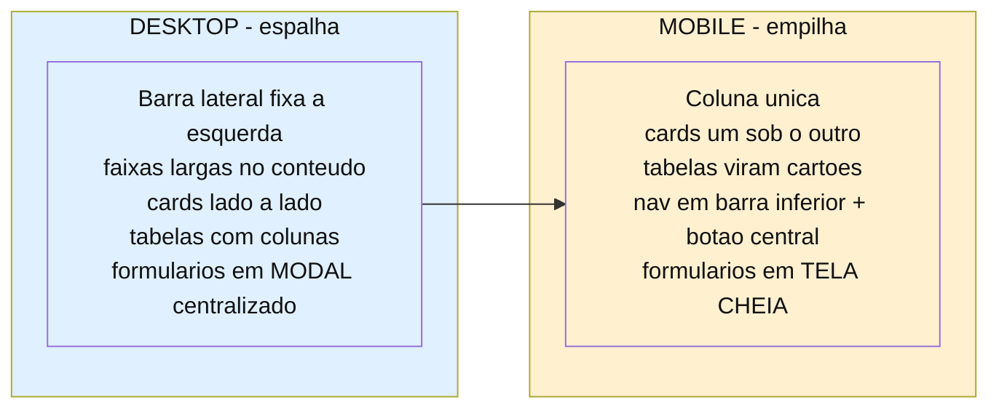

# Budgy Finance — UX e Especificação de Telas

| | |
|---|---|
| **Fase** | Gerenciador manual pessoal + insight enxuto (Fase 1) |
| **Base** | Product Vision r5, Modelo de Dados (ERD), Camada de Domínio (Spec), ADR |
| **Plataforma** | **Desktop-first**, com adaptação mobile obrigatória |
| **Natureza** | Especificação de layout, conteúdo e comportamento. Não é código nem visual final. |
| **Para quê** | Contexto completo para o trabalho de design/telas, separado do chat de arquitetura. |

> **Como ler.** Este documento é autossuficiente: contém o contexto de produto necessário, os princípios que geraram cada decisão, o sistema visual compartilhado e a especificação das seis telas. As decisões marcadas com ⚠ são travadas — têm motivo registrado e não devem ser "simplificadas" sem revisitar o porquê.

---

## 1. Contexto mínimo do produto

App de **gestão financeira pessoal manual**, uso próprio (n=1, o fundador). O usuário registra entradas e despesas à mão, separa **despesas fixas** (recorrentes) de **variáveis**, acompanha o que está pago/pendente, e define um **teto de gasto variável** com alerta.

**O objetivo declarado do produto é frear gasto** — não é planejar, não é investir. Isso decide toda a hierarquia visual: o número que diz "você ainda pode gastar?" é o herói do app.

**Os dois riscos que a UX precisa combater:**
1. **Atrito de lançamento** — registrar à mão cansa, e é por isso que apps financeiros são abandonados em semanas. Cada campo obrigatório a mais é um pedágio.
2. **Número que mente** — um valor errado ou uma falsa sensação de controle destrói a credibilidade num único deslize. A tela nunca pode mostrar situação melhor que a real.

**Conceitos do domínio que a UX precisa respeitar:**

| Conceito | O que significa |
|---|---|
| **Carteira** | Conta ou vale-alimentação (VA). Cada uma tem saldo próprio. O **VA é restrito a alimentação** e **nunca** é somado ao saldo livre. |
| **Fixa vs variável** | Fixa é recorrente (modelo que gera ocorrências mensais). Variável é lançamento avulso. **Só a variável conta no teto.** |
| **Competência (mês)** | Todo lançamento pertence a um mês. As telas operam sempre sobre um mês de cada vez. |
| **Saldo vs fluxo** | **Saldo** = estoque, acumula entre meses, é "o que tenho agora". **Entrada/saída do mês** = fluxo, zeram a cada mês. Nunca confundir os dois na tela. |
| **Caixa vs controle** | **Caixa** (saldo, entrada do mês) conta só o efetivado (`recebido`/`pago`). **Controle** (teto, falta pagar) conta o comprometido (inclui `pendente`). Divergem de propósito. |

⚠ **Consequência de UX da assimetria caixa/controle:** o gasto variável comparado ao teto **inclui pendentes**, enquanto o saldo só reflete o pago. Ou seja, o variável pode "estourar" o teto enquanto ainda há dinheiro na conta. O card do teto deve explicitar isso (ex.: "inclui contas ainda não pagas"), senão confunde.

---

## 2. Princípios de design (as regras que geraram as telas)

**P1 — O caminho quente é quase sem atrito.** Lançar uma despesa variável é o gesto mais repetido do app. O caminho feliz é: *digitar o valor → tocar a categoria → salvar*. Tudo que pode ter valor-padrão inteligente, tem.

**P2 — Padrão inteligente em vez de campo obrigatório.** Data (hoje), carteira (conta) e status (pago) vêm preenchidos. O usuário só toca no que fugir do padrão. No dia comum, não toca em nenhum.

**P3 — Hierarquia por urgência, não por importância.** A Home se lê em três camadas: **o pulso** (posso gastar?), **o dever** (o que preciso pagar?), **o entendimento** (para onde foi meu dinheiro?). Ação sempre antes de reflexão.

**P4 — Prudência visual.** Quando dois números divergem, mostrar o mais conservador em destaque. A tela nunca deixa o usuário otimista demais.

**P5 — Freio de escopo.** Insight é enxuto: um gráfico por categoria + uma comparação mês a mês. Nada de tendência, projeção, média móvel ou "central de analytics".

---

## 3. Sistema visual compartilhado

Estes elementos se repetem entre telas e devem ser consistentes.

### 3.1 Cores por significado (não decorativas)

| Cor | Significado |
|---|---|
| **Verde** | Entrada / recebido / dinheiro que chega |
| **Neutro** | Saída / pago / estado resolvido |
| **Âmbar** | Alerta: aproximando do teto, entrada `previsto`, avisos importantes |
| **Vermelho** | Atrasado, teto estourado, ação destrutiva |

### 3.2 Componentes recorrentes

**Campo de valor (herói dos formulários).** Fonte grande, centralizado, abre já em foco com teclado numérico. Formato `R$ 0,00`. Verde nas entradas, neutro nas despesas.

**Chips de categoria.** Categoria é lista controlada (nunca texto livre) — por isso cabe em chips tocáveis, não dropdown. Mostrar 5-6 comuns + chip `+ mais` para o resto e para criar novas. Um toque seleciona.

**Tira de padrões.** Três campos compactos lado a lado, já preenchidos, tocáveis para alterar: **data**, **carteira**, **status**. Padrão visualmente "resolvido" (não parece campo vazio esperando input).

**Descrição opcional.** Uma linha discreta e recolhida (`+ descrição`) que só expande ao toque. Nunca obrigatória, nunca em destaque.

**Tabelas.** No desktop, listas de dados são tabelas com cabeçalho (colunas alinhadas, fácil de escanear). ⚠ **No mobile, cada linha da tabela vira um cartão** — nunca rolagem horizontal.

### 3.3 Formato de dados

- Dinheiro sempre `R$ 1.234,56` (padrão brasileiro).
- Percentual do teto: inteiro, **arredondado para baixo** (79,8% → 79%). Regra fixa em todo o app.
- Datas: `dd/mm` nas listas, por extenso quando houver espaço.

### 3.4 Design tokens (extraídos do repositório)

O app é **dark mode**. Não há modo claro.

| Papel | Token |
|---|---|
| **Fundos** | base `#08091A` · sidebar `#0D1021` · card `#111827` · card hover `#161D2F` · elevado `#1A2235` |
| **Marca** (ação, botão primário, seleção) | `#6C63F5` · hover `#5A52D5` · light `#7E77F7` · muted `#2D2A5E` |
| **Verde** — entrada, recebido | `#22C55E` · fundo de card `#0F2818` |
| **Âmbar** — alerta, perto do teto, previsto | `#F59E0B` · fundo de card `#2A1A08` |
| **Vermelho** — atrasado, teto estourado, destrutivo | `#EF4444` · fundo de card `#2A1010` |
| **Texto** | primário `#FFFFFF` · secundário `#8892A4` · muted `#4B5468` |
| **Bordas** | sutil `#1C2438` · padrão `#252E45` · foco `#6C63F5` |
| **Raio** | card 12px · input 8px · badge 6px |
| **Fonte** | Inter — ⚠ `font-variant-numeric: tabular-nums` **global** (sem isso as colunas de valor desalinham) |

⚠ **Paleta categórica (só para o gráfico por categoria):** `#6C63F5` `#7E77F7` `#4F8DF5` `#3FB6C9` `#8E7CC3` `#5A6478`. Ela existe **porque** verde, âmbar e vermelho já carregam significado semântico — usar verde para "Lazer" embaralharia a leitura. Mesma categoria = mesma cor em todos os gráficos.

> **Nota sobre o repositório:** o `warning` original era laranja `#F97316`, trocado por âmbar `#F59E0B` porque ficava próximo demais do vermelho — e o card do teto precisa que "perto do limite" e "estourou" sejam inconfundíveis. Tokens legados de `auth`/`panel`/`hero` (da tela de cadastro e seleção de banco do produto anterior) estão fora de escopo nesta fase.

---

## 4. Regra de responsividade

**Desktop é o alvo primário; mobile é adaptação para baixo.** A informação e a hierarquia são as mesmas — muda o **arranjo**.

**Regras fixas de adaptação:**
- A **ordem vertical do conteúdo nunca muda** entre desktop e mobile. O que está acima no desktop continua acima no mobile.
- Formulário: **modal centralizado** no desktop, **tela cheia** no mobile.
- Navegação: **barra lateral fixa à esquerda** (desktop, ~240px, fundo `#0D1021`, recolhível para ~64px) → **barra inferior com botão "+" central** (mobile). Nunca menu hambúrguer.
- Tabela: **linhas com colunas** (desktop) → **cartões empilhados** (mobile).

**Estrutura da barra lateral (desktop):**
- Topo: logo + nome "Budgy"
- Itens de navegação com ícone + rótulo: Início · Lançamentos · Configuração. Item ativo com fundo `#2D2A5E` e texto `#7E77F7`; inativos em `#8892A4`.
- Rodapé: avatar + nome do usuário, discreto.
- **Recolhível:** um controle estreita para ~64px mostrando só ícones (tooltip no hover) — útil para ganhar largura na tabela de lançamentos.

**Header contextual (área de conteúdo, não a lateral):**
- Título da tela atual
- Navegador de mês (‹ julho 2026 ›) — só nas telas que operam por mês
- Botão "Nova despesa" (ou "Novo" no Histórico)

⚠ A lateral responde **"onde estou"** (navegação entre telas). O header responde **"o que faço aqui"** (ações e contexto do mês). Os dois papéis são distintos e não se misturam.

⚠ A tela de **primeiro uso** não exibe a lateral — é tela bloqueante e limpa, sem navegação disponível até a primeira carteira ser criada.

**Breakpoints:** desktop acima de 1024px · tablet 640–1024px · mobile abaixo de 640px.

---

## 5. As seis telas

### 5.1 Nova despesa (variável)

**Propósito.** Lançar UMA despesa variável, o mais rápido possível. É a tela mais crítica do app.
**Formato.** Modal centralizado (desktop) / tela cheia (mobile).

**Conteúdo, de cima para baixo:**
1. Cabeçalho: título "Nova despesa" + fechar.
2. **Valor** — campo herói, fonte grande, centralizado, abre em foco.
3. **Categoria** — obrigatória, em chips. Salvar fica inativo sem ela.
4. **Tira de padrões** — Data `Hoje` · Carteira `Conta` · Status `Pago`.
5. **Descrição** — opcional, recolhida.
6. Ações: **Salvar** (primário) e **Salvar e adicionar outra** (secundário discreto).

**Comportamentos:**
- ⚠ Selecionar carteira **VA** faz a categoria saltar automaticamente para **Alimentação** (editável) — o VA é de uso restrito a alimentação.
- ⚠ Status padrão é **Pago**: uma despesa variável normalmente já foi gasta no momento do lançamento.
- "Salvar e adicionar outra" existe para o hábito de lançar vários seguidos (ex.: conferir o extrato uma vez por semana e registrar o que faltou). Mantém o usuário no fluxo.

**⚠ NÃO incluir:**
- Seletor de tipo fixa/variável — esta tela é **exclusivamente variável**. Fixa tem fluxo próprio.
- Descrição obrigatória.
- Qualquer número agregado (saldo, teto) — esta tela é só entrada de dado.

---

### 5.2 Home

**Propósito.** Responder, em ordem: posso gastar? o que preciso pagar? para onde foi meu dinheiro?
**Formato.** Faixas horizontais de largura total (desktop) / coluna única (mobile).

**Cabeçalho:** navegação (Início · Lançamentos · Config), **navegador de mês** (‹ julho 2026 ›), botão **Nova despesa**, avatar.
⚠ Abre **sempre no mês atual**.

**Faixa 1 — O PULSO (cards em linha):**
- ⚠ **Card do teto — o herói.** Maior que os demais, colorido, com barra de progresso. Mostra gasto variável do mês, o teto, o percentual e quanto resta. **Muda de cor conforme o estado:** neutro (longe), âmbar (perto), vermelho (estourou). Um toque no valor do teto abre o **ajuste rápido** (o teto é editável a partir da Home).
- **Saldo livre** — o caixa real (nunca inclui VA).
- **Entrada do mês** (verde), legenda "recebido em julho".
- **Saída do mês** (neutro), legenda "pago em julho".
- **Total de fixas**.

⚠ **Três números de despesa, três regras — as legendas são obrigatórias.** *Saída do mês* conta só o **pago**; *total de fixas* conta **todas** as fixas do mês (pagas ou não); *gasto variável* (o do teto) conta **todas** as variáveis (pagas ou não, fora VA). Sem as legendas "recebido em"/"pago em", o usuário tenta somar fixas + variável esperando bater com a saída, não bate, e parece bug.

⚠ **O card do VA não aparece na Home** (decisão D20). O saldo do VA vive em Config → Carteiras. A função `saldoVA` continua existindo no domínio — é decisão de exibição, reversível.

⚠ **Saída usa cor neutra, nunca vermelho.** Vermelho neste app significa atrasado ou teto estourado, não "dinheiro saindo".

**Faixa 2 — O DEVER (largura total):**
- ⚠ **"Falta pagar" como TABELA.** Colunas: conta · categoria · vencimento · valor · ação (`pagar`).
- Total à direita no cabeçalho da tabela.
- **Atrasado** sinalizado em vermelho, com selo, e listado primeiro.
- ⚠ Mostrar **2 a 5 itens** + link **"ver todos (N)"** que leva ao Histórico filtrado.
- ⚠ Esta faixa fica **antes dos gráficos** — ação antes de reflexão.

**Faixa 3 — O ENTENDIMENTO (dois gráficos lado a lado):**
- **Gasto por categoria** (barras). Usa a **paleta categórica** (ver §3.4) — nunca as cores semânticas.
- **Comparação mês a mês** (barras, mês atual destacado). ⚠ **Mostra apenas os meses que já têm dado, e cresce com o tempo:** 1 mês de uso = 1 barra; 3 meses = 3 barras; a partir de 6, estabiliza nos últimos 6. **Nunca** exibir meses futuros, barras zeradas ou esconder o gráfico. Uma barra só é estado válido e precisa ficar apresentável.

**⚠ NÃO incluir:** projeção, metas, reservas, tendência, previsão de sobra. Fora de escopo por decisão.

---

### 5.3 Nova entrada (receita)

**Propósito.** Lançar uma receita avulsa (freela, extra, crédito do VA).
**Formato.** Modal centralizado (desktop) / tela cheia (mobile). Versão mais enxuta da Nova despesa.

**Conteúdo:**
1. Cabeçalho "Nova entrada".
2. **Valor** — herói, **em verde**, abre em foco.
3. **Tira de padrões** — Data `Hoje` · Carteira `Conta` · Status `Recebido`.
4. **Categoria** — **opcional** (Salário, Freela, Outros + `mais`).
5. **Descrição** — opcional, recolhida.
6. Ação: **Salvar**.

**Comportamentos:**
- ⚠ Status alterna entre **Recebido** (padrão) e **Previsto**. **Uma entrada `previsto` NÃO entra no saldo nem na "entrada do mês"** — ela aparece na lista marcada como previsto e só passa a contar quando o usuário confirma o recebimento (no Histórico).
- Carteira aqui significa **onde o dinheiro caiu** (destino), não de onde saiu. O **VA é destino válido** (o crédito mensal do vale cai nele).
- Categoria é opcional, mas será usada — serve para saber a origem do dinheiro.

**⚠ NÃO incluir:** "Salvar e adicionar outra" (entrada avulsa é rara); teto; obrigatoriedade de categoria.

---

### 5.4 Nova despesa fixa

**Propósito.** Criar um **modelo recorrente** que gera ocorrências mensais automaticamente.
**Formato.** Modal centralizado (desktop) / tela cheia (mobile).

> ⚠ **A sutileza mais importante desta tela:** ela **não lança uma despesa** — ela cria o **molde** que vai gerar as despesas mês a mês. Se a tela parecer com a Nova despesa, o usuário acha que está "pagando o aluguel agora" quando está "ensinando o app que todo dia 15 nasce um aluguel". A linguagem inteira da tela existe para evitar essa confusão.

**Conteúdo:**
1. Cabeçalho: "Nova despesa fixa" + subtítulo **"cria uma conta que se repete todo mês"**.
2. **Nome da conta** — campo próprio em destaque (ex.: Aluguel, Internet). Não é "descrição opcional": a fixa precisa de nome para ser reconhecida mês a mês.
3. **Valor** + **"vence todo dia [N]"** lado a lado. A expressão "todo dia" reforça a recorrência.
4. **Categoria** — obrigatória (fixas também entram no gráfico por categoria).
5. **Carteira** — padrão Conta.
6. **Vigência** — recolhida como "avançado". ⚠ Padrão: **começa neste mês, sem data de fim**.
7. ⚠ **Aviso em tempo real:** "Vai repetir todo **dia 15**, a partir deste mês."
8. Ação: ⚠ botão **"Criar recorrência"** (não "Salvar") — o verbo descreve o que acontece.

**Comportamentos:**
- ⚠ Ao criar, o sistema **já materializa a ocorrência do mês corrente** como `pendente` — ela aparece imediatamente no "falta pagar". O usuário pode marcá-la como paga a qualquer momento, **na Home ou no Histórico**.
- Se o dia escolhido não existe no mês (ex.: 31 em fevereiro), a ocorrência cai no **último dia do mês**.

**⚠ NÃO incluir:** marcar como pago nesta tela. Pagar acontece onde se paga (Home/Histórico) — misturar reconfunde molde com pagamento.

---

### 5.5 Histórico / Lançamentos

**Propósito.** Ver o movimento do mês, pagar pendentes, confirmar recebimentos, editar.
**Formato.** Tabela de largura total (desktop) / cartões empilhados (mobile).

**Cabeçalho:** navegador de mês + botão ⚠ **"Novo"** (genérico — abre mini-escolha *despesa | entrada* antes do formulário).

**Linha de resumo:** entrada · saída · saldo do mês (síntese do filtro atual, não duplica a Home).

**Filtros (chips):** `Tudo` · `Despesas` · `Entradas` · `Pendentes` · `A receber`.
⚠ Apenas estes. Não adicionar filtro por categoria/carteira/tipo sem evidência de necessidade (freio de escopo).

**Tabela — colunas:** data · descrição · carteira · valor · status · ação.
- ⚠ **Lista unificada**: entradas e saídas juntas, em ordem de data (como um extrato). Diferenciadas por cor e sinal: entrada `+R$` em verde, saída `−R$` em neutro.
- A descrição carrega contexto compacto: `Aluguel · Casa · fixa` (categoria e, quando recorrente, o selo "fixa").
- ⚠ **Selo de competência quando ela difere do mês da data.** O salário recebido em 25/07 pertence a agosto (ver §5.7). Na lista de agosto ele aparece com a data real e um selo discreto: `25/07 · competência agosto`. Sem isso, um lançamento de julho listado em agosto parece erro.
- **Status** com cor: recebido (verde) · pago (neutro) · pendente (neutro) · atrasado (vermelho) · previsto (âmbar).
- ⚠ **Ações contextuais:** `pendente`/`atrasado` → botão **pagar**; `previsto` → botão **confirmar** (vira recebido); resolvidos → menu `⋯` (editar/excluir).

---

### 5.6 Configuração

**Propósito.** Perfil, categorias, carteiras, alertas.
**Formato.** Menu de seções à esquerda + conteúdo à direita (desktop) / lista de seções navegável (mobile).

**Seções:** Perfil · Categorias · Carteiras · Alertas.

**Perfil:** foto e preferência de alerta. Simples.

**Categorias:**
- ⚠ Separadas por fluxo: **DESPESA** e **ENTRADA** (uma categoria de despesa não aparece no seletor de entrada).
- Categorias **padrão** (semeadas) têm selo "padrão" e cadeado — protegidas.
- Categorias criadas pelo usuário têm selo "sua" e podem ser editadas.
- ⚠ **Remover = desativar, nunca apagar.** Uma categoria desativada some do seletor de novos lançamentos, mas os lançamentos antigos mantêm o vínculo (o gráfico por categoria continua íntegro). **Deve ser possível reativar depois.**
- Ação `+ nova categoria` em cada fluxo.

**Carteiras:**
- Lista mostrando, por carteira: nome, tipo, **saldo inicial**, **data de início** e **saldo atual**.
- VA marcado com selo **"uso restrito"**.
- Formulário de nova carteira: nome · tipo (Conta | Vale-alimentação) · **saldo inicial** · **a partir de** (data).
- ⚠ **Saldo inicial e data de início são definidos na criação e NÃO podem ser alterados depois.** Ambos exibem cadeado, e o formulário traz um **card de aviso em âmbar**:
  > *A carteira nasce zerada e o saldo inicial é definitivo. Nenhum lançamento de outra carteira é migrado — o histórico continua onde foi feito. O saldo inicial e a data informados agora não poderão ser alterados depois, então confira antes de criar.*
- É aqui que o **VA é cadastrado** (não no primeiro uso).

> **Por que o saldo inicial existe:** o app não conhece o dinheiro que já estava na conta antes do primeiro uso. Sem essa âncora, o saldo mostraria só o movimento a partir de hoje e mentiria. `saldo = saldo inicial + entradas recebidas − despesas pagas`.

---

### 5.7 Competência — regra transversal aos formulários

O usuário recebe **dia 25** e considera esse dinheiro como sendo do **mês seguinte**. O sistema resolve isso sem inventar mês fiscal:

- **Salário (entrada recorrente):** o modelo carrega um deslocamento de competência. O recebimento de 25/07 fica com data 25/07 e **competência agosto**. Configurado uma vez no cadastro da recorrência, não a cada mês.
- **Contas pagas adiantado:** funcionam sozinhas. A competência da despesa vem do **vencimento**, não do pagamento — pagar em 27/07 uma conta que vence em 05/08 mantém a despesa em agosto, marcada como paga. Nenhum controle de UI necessário.
- **Lançamento avulso:** os formulários (Nova despesa, Nova entrada) têm um controle de competência **opcional e recolhido**, junto da vigência/avançado. Existe para o caso excepcional; **não** deve aparecer no caminho quente.

⚠ **Efeito visível que a UX precisa acomodar:** entre 25 e 31, o salário **está** no saldo (é caixa real) mas **não** aparece na "entrada do mês" corrente (pertence ao mês seguinte). Está correto — mas as legendas dos cards e o selo de competência no Histórico existem para que isso não pareça bug.

---

### 5.8 Primeiro uso

**Propósito.** Destravar o app. Sem carteira o usuário não consegue lançar nada (`wallet_id` é obrigatório) — este é o **único** impedimento técnico real, e por isso o único passo bloqueante.
**Formato.** Tela única centralizada, antes da Home. Só aparece enquanto não existir nenhuma carteira.

**Conteúdo:**
1. Título: "Vamos começar pela sua conta" + subtítulo explicando que leva um minuto e é só uma vez.
2. **Nome da carteira** e **tipo** (Conta | Vale-alimentação, padrão Conta).
3. ⚠ **Saldo inicial** + **"a partir de"** (data) — os dois lado a lado, ambos com cadeado e destaque âmbar.
4. Microcópia: *"Informe quanto havia na conta **nesse dia**. O app conta a partir daí — nada anterior é somado ou descontado."*
5. Card de aviso âmbar: os dois campos são definitivos e não poderão ser alterados.
6. Botão **"Criar carteira e começar"**.
7. Rodapé discreto: "Depois você define o teto e cadastra as contas fixas — o próprio app te lembra disso na tela inicial."

**Comportamentos:**
- ⚠ **Saldo inicial e data de início são uma decisão só, não dois campos.** Devem ser apresentados visualmente pareados (mesma borda, mesmo cadeado): `R$ 3.000` não significa nada sem "em que dia". Travam juntos.
- Data pré-preenchida com o **primeiro dia do mês corrente** (escolha mais comum).
- ⚠ **Só a conta é criada aqui.** O VA fica para Config → Carteiras (D27) — manter a tela curta é mais importante que completude no primeiro minuto.
- ⚠ **Não há wizard.** Teto e despesas fixas **não** são pedidos aqui. Quem convida a defini-los são os empty states da Home: o card do teto em estado "sem teto" e o "falta pagar" vazio. Prende menos e ensina onde as coisas vivem.

> **Nota de primeiro mês (transitória).** Quem começa a contar no dia 1º mas recebe antes da virada (ver §5.7) terá o salário embutido no saldo inicial, e o card "entrada do mês" ficaria zerado no primeiro mês. Orientação: informar o saldo inicial **menos o salário** e lançar o salário como entrada avulsa com a competência correta. É um ajuste de uma vez só — a partir do mês seguinte a recorrência resolve sozinha.

---

## 6. Estados que o design precisa cobrir

Fáceis de esquecer e responsáveis por telas quebradas:

| Estado | Onde | Tratamento |
|---|---|---|
| **Sem teto definido no mês** | Home, card do teto | Estado "sem teto" — **nunca mostrar zero** (zero mentiria). Convidar a definir. |
| **Teto estourado** | Home, card do teto | Vermelho, mensagem clara. Este é o momento em que o app cumpre seu objetivo. |
| **Nenhum lançamento no mês** | Home, Histórico | Empty state que convida ao primeiro lançamento, não uma tela em branco. |
| **Nada a pagar** | Home, faixa "falta pagar" | Estado positivo ("tudo em dia"), não a tabela vazia. |
| **Primeira vez / app zerado** | Tela de primeiro uso (§5.8) | Uma tela bloqueante só para criar a primeira carteira. Depois dela, a Home abre normal com cada bloco em seu estado vazio. |
| **Valor longo** | Cards e tabelas | `R$ 12.345,67` não pode quebrar o layout. |

---

## 7. Decisões travadas (com motivo)

| # | Decisão | Por quê |
|---|---|---|
| D1 | Tela de lançamento é **variável-only** | Seletor fixa/variável adicionaria atrito ao caso de 95% para servir o de 5%. |
| D2 | Status padrão da despesa = **pago** | Variável avulsa normalmente já foi gasta ao ser lançada. |
| D3 | Carteira VA **puxa categoria Alimentação** | VA é de uso restrito; economiza um toque no caso do VA. |
| D4 | Categoria **obrigatória** na despesa, **opcional** na entrada | O insight do produto mora no gasto, não na receita. |
| D5 | **Teto é o herói** da Home | O objetivo do produto é frear gasto; o teto é o número que muda comportamento. |
| D6 | **Saldo livre no topo, VA discreto** | O VA não é contado no dia a dia; destacá-lo poluiria. |
| D7 | Home abre **sempre no mês atual** | É o que importa 95% do tempo; navegar meses é secundário. |
| D8 | **"Falta pagar" antes dos gráficos** | Ação (dever) antes de reflexão (entendimento). |
| D9 | "Falta pagar" como **tabela**, 2-5 itens + "ver todos" | Tabela lê melhor no desktop; limite evita Home longa. |
| D10 | **Gráficos na Home** (não só em aba) | No desktop cabem sem custo de rolagem. |
| D11 | Balão de **total de fixas**, sem "sobra estimada" | Total de fixas é fato sempre verdadeiro; "sobra" seria projeção que oscila e assusta. |
| D12 | Entrada **previsto** não entra nos totais | Contar dinheiro que não caiu infla o saldo (falsa sensação de controle). |
| D13 | Fixa cria **molde**, não lançamento; botão "Criar recorrência" | Evita confundir cadastrar com pagar. |
| D14 | Criar fixa **materializa o mês corrente** | Evita "mês fantasma" sem a ocorrência. |
| D15 | Histórico com **lista unificada** | Abas separadas obrigariam a trocar de aba o tempo todo; extrato mostra o fluxo real. |
| D16 | Botão **"Novo"** com mini-escolha | Evita dois botões no topo. |
| D17 | Categoria: **desativar, nunca apagar** (reativável) | Apagar deixaria lançamentos órfãos e quebraria o gráfico. |
| D18 | **Saldo inicial imutável** após criar a carteira | Editar deslocaria todo o histórico de saldo retroativamente e em silêncio. |
| D19 | Criar carteira nova **não migra** lançamentos, com aviso | `wallet_id` prende o lançamento à carteira; o aviso evita a surpresa. |

| D20 | **VA sai da Home**; fica só em Config → Carteiras | O saldo do VA é consultável no app do próprio vale; na Home ocupava um slot sem uso diário. Decisão de exibição, reversível — `saldoVA` segue no domínio. |
| D21 | **"Saída do mês" entra** na faixa de cards, em neutro, com legenda "pago em" | Faltava o número de quanto já saiu. Legenda obrigatória porque saída (só pago) segue regra diferente de fixas e variável (pago + pendente). |
| D22 | Gráfico mês a mês **mostra só meses com dado** e cresce | Com 1 mês de uso, 6 barras vazias pareceriam quebradas. |
| D23 | **Competência deslocada** para o salário; **selo** no Histórico quando difere da data | O fundador recebe dia 25 e conta como mês seguinte. Exceção declarada, não mês fiscal (ver ADR-018). |
| D24 | Controle de competência em lançamento avulso é **opcional e recolhido** | Serve o caso raro sem cobrar pedágio no caminho quente. |
| D25 | Saldo inicial tem **data de início** (`opening_date`) e os dois travam juntos | Saldo é foto de um instante; sem a data, um lançamento anterior seria descontado duas vezes (o saldo já o embute). |
| D26 | Primeiro uso é **uma tela bloqueante só para a carteira** — sem wizard | Carteira é o único impedimento técnico. Teto e fixas são convidados pelos empty states da Home, que prendem menos e ensinam onde as coisas vivem. |
| D27 | **VA não é criado no primeiro uso**, só em Config → Carteiras | Manter a tela de entrada curta vale mais que completude no primeiro minuto. |

> ⚠ **Lacuna aceita (D18/D19):** um erro de digitação no saldo inicial não tem correção limpa — criar carteira nova deixa o histórico para trás. Se isso incomodar no uso real, a saída é um **lançamento de ajuste** ("ajuste de saldo inicial") em vez de tornar o campo editável.

> ⚠ **Imperfeição aceita (D23):** o gasto variável entre 25 e 31 conta no teto do mês corrente, embora bancado pelo salário do mês seguinte — sobreposição de ~6 dias. Se o controle manual de competência acabar sendo usado toda semana nesse período, é sinal de que o mês fiscal completo era necessário. Reabrir com dado de uso real, não por especulação.

---

## 8. Pontos em aberto para o design

1. ~~Fidelidade~~ — **resolvido:** alta fidelidade.
2. ~~Identidade visual~~ — **resolvido:** tokens reais do repositório (§3.4).
3. ~~Modo claro/escuro~~ — **resolvido:** dark mode, herdado do repositório.
4. ~~"Saída do mês" na Home~~ — **resolvido:** entra (D21), trocando de lugar com o card do VA (D20).
5. ~~Primeiro uso~~ — **resolvido:** tela única bloqueante de criação da primeira carteira (§5.8), com `opening_date`. Sem wizard.
6. **Mobile** — as versões mobile ainda não foram geradas. A conversão crítica é **tabela → cartões** (falta pagar e Histórico); rolagem horizontal de tabela é inaceitável.

---

*Documento de handoff de UX. A arquitetura (modelo de dados, camada de domínio, ADR) vive em documentos separados e não deve ser redecidida aqui.*
